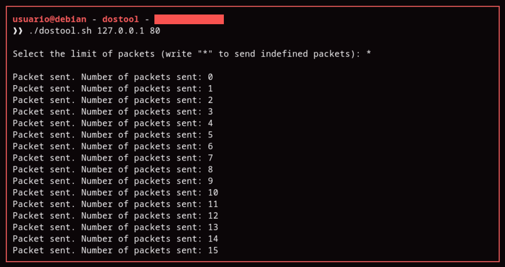

# DOSTool - Easy & Fast DOS attack tool

## Overview

I created this easy and little script just to practice bash scripting since I'm learning (slow and steady) how to code on it. I'm uploading this to github so I can have future references on what to write and how to do this, since this is just the start of a good journey.

## Starting the script

You need to give the script the permissions to use it.
```bash
chmod +x dostool.sh
```

And the syntax to use it is:

```bash
./dostool.sh [ip_address] [port]
```

## How does it work?

It's pretty straightforward. It sends UDP packages to a target on the port you want. I thought about using UDP because packets travel faster than in TCP, but sooner or later I'll do a function to select TCP packets instead.

## Usage example



## To do

- Add a function to send TCP packets
- Add a better optimization
